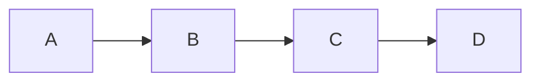

## Mermaid渲染支持
Hugo默认不支持Mermaid渲染，因此需要手动配置。

参考链接：[让Hugo Papermod主题支持 Mermaid](https://lingzihuan.icu/posts/hugo-papermod-mermaid/)

新增`layouts/partials/extend_head.html`文件，填上Mermaid渲染的代码：
```html
<!-- 使用cdn加载文件 -->
<script src="https://cdn.jsdelivr.net/npm/mermaid/dist/mermaid.min.js"></script>
<script>
// 自定义mermaid配置
const config = {
    startOnLoad:true,
    theme: 'forest',
    themeVariables: {
        lineColor: "#fafafa"    // 由于paperMod的代码块背景是黑色的，这里将线条设置为白色
    },
    flowchart: {
        useMaxWidth:false,
        htmlLabels:true
        }
};
mermaid.initialize(config);
// 需要注意的是，要将初始化代码放到 window.onload 回调函数里面才有用
// 否则会因为在html元素加载前进行初始化，找不到元素而失效
window.onload = () => {
    window.mermaid.init(undefined, document.querySelectorAll('.language-mermaid'));
}
</script>
```

渲染结果：

